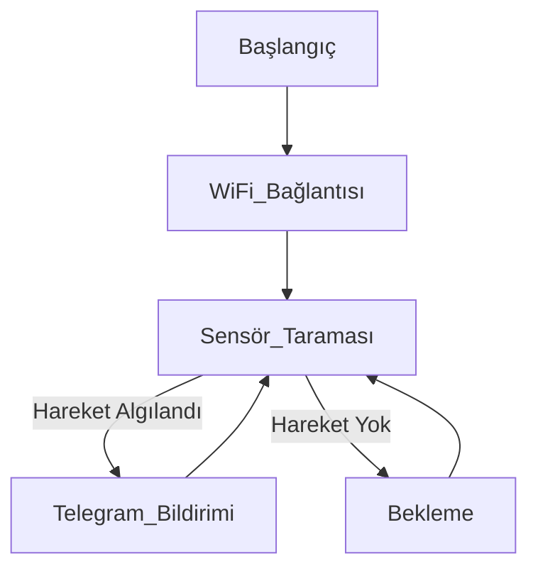

# Proje Konusu

Bu proje, evdeki üç farklı odanın güvenliğini sağlamak amacıyla, her birine yerleştirilen hareket sensörleriyle çalışan akıllı bir güvenlik sistemi geliştirmeyi amaçlamaktadır. Sistem, hareket algılandığında kullanıcıya anında Telegram üzerinden bildirim gönderir. Geliştirilen ürün sonucunda kişi evde yokken evde hangi odada hareket tespit edildiği bilgisine sahip olur.

# Özet

Proje, Raspberry Pi Pico W ve üç adet PIR hareket sensörü kullanılarak geliştirilmiş bir IoT tabanlı güvenlik sistemidir. Her sensör farklı bir odayı temsil eder ve bu odalarda hareket algılandığında, sistem ilgili oda bilgisini de içeren bir uyarıyı Telegram botu aracılığıyla kullanıcıya iletir.

# Kullanılan Yöntemler

### Donanım

| Bileşen                  | Açıklama                                                                 |
|--------------------------|--------------------------------------------------------------------------|
| Raspberry Pi Pico W      | Wi-Fi destekli, RP2040 mikrodenetleyici tabanlı geliştirme kartı         |
| 3x PIR Sensör (HC-SR501) | Mutfak (GPIO 20), Garaj (GPIO 19), Koridor (GPIO 18) için hareket algılayıcı |
| Kill Switch (GPIO 21)    | Sistemin çalışmasını fiziksel olarak açma/kapama                         |
| Yerleşik LED             | Sistem durumunu kullanıcıya görsel olarak bildirir                       |

### Yazılım

| Bileşen                              | Açıklama                                                                  |
|--------------------------------------|---------------------------------------------------------------------------|
| Arduino C++ (Arduino-Pico Core)     | Pico W ile uyumlu C++ kodlama altyapısı                                   |
| UniversalTelegramBot                | Telegram API ile mesaj gönderimi                                          |
| ArduinoJson                         | JSON veri formatı için kullanılan kütüphane                               |
| WiFiClientSecure / X509 sertifika   | HTTPS üzerinden Telegram sunucusuyla güvenli bağlantı                     |
| NTP üzerinden zaman senkronizasyonu | Mesajlara zaman damgası eklemek için                                      |

### Metodoloji
 Her sensör, yapılandırılmış bir **`pir_sensor()`** dizisinde tanımlanır.
 **`loop()`** içinde sürekli izlenir, HIGH sinyali alınan sensör için bir defaya mahsus mesaj gönderilir (**`sent_message()`** kontrolü).
 Hareket yoksa **`sent_message()`** sıfırlanır ve tekrar tetiklenebilir hale gelir.
Kodda **`pin.value()`** ile sensör okuması yapılır, **`send_message()`** fonksiyonu ile Telegram’a bildirim gönderilir.

# Yapılan Teknik Çalışmalar

Bu projede Raspberry Pi Pico W kullanılarak üç adet PIR sensörle donatılmış çok odalı bir güvenlik sistemi oluşturulmuştur. Her sensör farklı bir fiziksel alanı temsil etmektedir: Mutfak, Garaj ve Koridor. Aşağıda sistemin kurulum ve çalışma yapısı, kullanılan temel fonksiyonlar bağlamında teknik olarak özetlenmiştir:

## Fonksiyonel Yapı

- **`setup()`**
  - Donanım başlatma: PIR sensör GPIO pinleri giriş olarak ayarlanır.
  - Wi-Fi yapılandırması yapılır ve Telegram bot ile güvenli bağlantı kurulur.
  - `configTime()` ile zaman senkronizasyonu sağlanır.
  - Sistem başlatıldığında LED gösterge ile kullanıcı bilgilendirilir ve Telegram üzerinden başlangıç mesajı gönderilir.

- **`loop()`**
  - `Kill Switch` kontrol edilir; sistem çalışmasını kullanıcı fiziksel olarak kontrol edebilir.
  - Tüm PIR sensörler sürekli taranır.
  - Hareket algılandığında sensör durumuna göre yalnızca bir defa bildirim yapılır.
  - `digitalRead()` ile sensör durumu okunur, `digitalWrite()` ile LED yanıt verir.
  - Algılanan hareket bilgisi `sendMessage()` aracılığıyla Telegram üzerinden zaman damgalı olarak kullanıcıya gönderilir.

- **`sendMessage()` (UniversalTelegramBot)**
  - Telegram Bot API ile güvenli şekilde mesaj iletimini gerçekleştirir.

- **`configTime()` (ESP zaman senkronizasyon fonksiyonu)**
  - İnternet üzerinden zaman bilgisini alarak olaylara zaman damgası eklenmesini sağlar.

- **`digitalRead()` / `digitalWrite()`**
  - GPIO pinlerinden veri okuma ve LED çıkış kontrolü işlemleri için kullanılır.

Bu yapı sayesinde sistem; hareketleri doğru şekilde algılar, oda bazlı bildirim üretir, kullanıcıyı zamanlı olarak bilgilendirir ve manuel olarak kontrol edilebilir modda çalışır.

## PIR Sensörlerin Çalışma Prensibi ve Sinyal Yapısı
HC-SR501 PIR (Passive Infrared) sensörleri, ortamda bulunan nesnelerin yaydığı kızılötesi (IR) ışını algılar. Bu sensörler 3.3–5V arası bir gerilimle çalışır ve çıkış olarak dijital sinyal üretir. Algılama durumunda OUT pininden yaklaşık 3.3V seviyesinde HIGH sinyal verir; hareket olmadığında bu sinyal LOW seviyesindedir. Raspberry Pi Pico W üzerindeki GPIO pinleri bu dijital çıkışları okuyarak olayları tespit eder. Sensörler, içinde iki ayrı IR dedektörü olan bir Fresnel lens ile IR dalga farklarını karşılaştırarak çalışır. Sensörün arkasındaki potansiyometreler ile algılama süresi ve mesafesi ayarlanabilir.

## GPIO Pinleri ve Elektriksel Arayüz
Raspberry Pi Pico W'de sensörler sırasıyla GPIO 18 (Koridor), GPIO 19 (Garaj) ve GPIO 20 (Mutfak) pinlerine bağlanmıştır. Bu pinler, `pinMode(pin, INPUT_PULLDOWN)` fonksiyonu ile giriş (input) olarak yapılandırılmıştır. Böylece sensörlerden gelen HIGH/LOW dijital sinyaller okunabilir. GPIO 21 pinine bağlı olan Kill Switch ise pinMode(21, INPUT); komutu ile yapılandırılmış olup, yazılım tarafından izlenerek sensörlerin dinlenmesini durdurmak amacıyla kullanılır. Yerleşik LED, LED_BUILTIN üzerinden pinMode(LED_BUILTIN, OUTPUT); fonksiyonu ile çıkış olarak tanımlanmıştır ve sistem durumu hakkında görsel bildirim sağlamak için kullanılmaktadır.

## Güvenli Bağlantı: WiFiClientSecure & TLS
Telegram Bot API ile yapılan tüm veri iletimi HTTPS protokolü üzerinden gerçekleşir. Bu nedenle WiFiClientSecure kütüphanesi kullanılarak bağlantı TLS 1.2 üzerinden güvence altına alınır. Telegram sunucusunun X.509 sertifikası projeye gömülerek, sunucu kimliğinin doğrulanması sağlanır. Bu, araya girme (MITM) saldırılarına karşı koruma sağlar.

# Elde Edilen Teknik Sonuçlar

Üç adet PIR (Passive Infrared) sensör, bağımsız GPIO pinleri (GPIO 18, 19, 20) üzerinden yapılandırılarak ayrı ayrı başarıyla konumlandırıldı.
Sensörlerden herhangi biri tarafından algılanan hareket, önceden yapılandırılmış struct dizisi aracılığıyla algılandığı odanın ismi ile ilişkilendirildi.
Telegram API aracılığıyla, olayın gerçekleştiği odaya özgü zaman damgalı mesaj, TLS sertifikalı HTTPS üzerinden başarılı şekilde iletildi.
Sistem yapısı, modüler sensör tanımı ile genişletilebilirlik prensibine uygun olarak tasarlandığından dolayı çok odalı (multi-zone) güvenlik izleme işlevselliği başarıyla sağlandı.

# Karşılaşılan Sorunlar ve Çözümler

Proje sürecinin ilk aşamalarında kullanılan Raspberry Pi Pico W kartı, donanımsal bir sorun nedeniyle çalışmaz hale gelmiştir. Yapılan testler ve bağlantı kontrolleri sonucunda kartın enerji verildiğinde yanıt vermediği ve USB arabirimi üzerinden tanınmadığı gözlemlenmiştir. Bu durumun, kısa devre veya hatalı besleme sonucu kartın zarar görmesinden kaynaklandığı değerlendirilmiştir. Sorunun çözümü olarak yeni bir Raspberry Pi Pico W temin edilmiş ve sistem baştan kurulmuştur. Bu süreç, donanım testlerinin ve bağlantıların daha dikkatli yapılması gerektiğini ortaya koymuş, ilerleyen çalışmalarda daha dikkatli bir entegrasyon süreci izlenmesine neden olmuştur.

# Projenin Devamında Yapılacaklar

Şu an sistemimiz, tek bir PIR sensör ile temel seviyede çalıştırılmış ve Telegram bildirim altyapısı test edilmiştir. Projenin ilerleyen aşamasında ise, gerçek bir ev ortamını simüle edebilmek amacıyla çok odalı bir maket ev tasarlanması planlanmaktadır. Bu maket yapıda üç farklı oda oluşturularak, her bir odaya bir PIR sensör entegre edilecektir. Böylece sistem, hangi odada hareket algılandığını doğru şekilde tespit edebilecek ve kullanıcıya ilgili bildirimleri odalara özel olarak iletebilecektir. Bu geliştirme, güvenlik sistemimizin hem işlevselliğini hem de görselliğini artırarak proje bütünlüğünü güçlendirecektir.

# Projenin Akış Şeması

